# Regard — maison d'optique, La Marsa

A marketing site, catalogue and frame configurator for an independent optician in La Marsa, Tunis. Everything is in French, and the content is real: eyewear houses, their models and logos, full-bleed photography, and a hero built on actual footage.

> **Regard** is a placeholder name. Brand, address, prices and photos all live in `/content` and can be swapped without touching a component. See [Before launch](#before-launch).

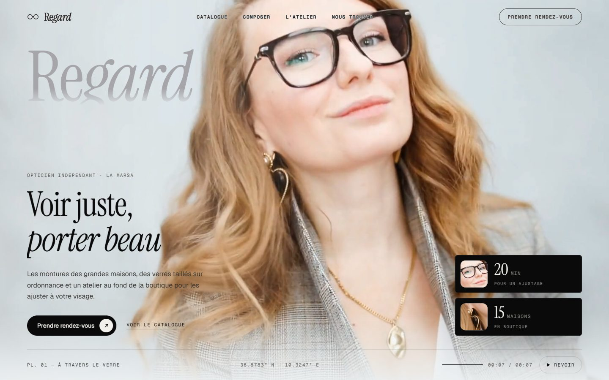

---

## Contents

- [The idea](#the-idea)
- [Screenshots](#screenshots)
- [Stack](#stack)
- [Getting started](#getting-started)
- [Project structure](#project-structure)
- [Editing the content](#editing-the-content)
- [How it works](#how-it-works)
- [Before launch](#before-launch)
- [Media, licences and credits](#media-licences-and-credits)
- [Quality checks](#quality-checks)
- [Deploying](#deploying)

---

## The idea

**Focus.** Everything on the site arrives the way an image sharpens when you put glasses on: blur to sharp, never bouncy, never sliding far.

- **The hero film** is two shots joined through a lens. It opens on a thin metal frame on an optician's chart of Landolt rings, the focus pulling through the lenses. The camera pushes into the right lens; the lens fills with the second shot, the rim sweeps past in a soft bloom of light, and the camera comes out pulling back and levelling off from a slight roll, like a drone. In the second shot a woman unfolds a pair of glasses, puts them on and smiles (slowed 1.8× with motion-compensated interpolation), and the film holds on that smile. The copy waits for the camera to settle (`REVEAL_AT = 5 s`) and runs its own blur-to-sharp reveal in step with the footage. Phones get their own 4:5 portrait cut of the film.
- **The wordmark** sits on the bare wall to her left with `mix-blend-mode: darken`, so her hair, darker than the letters, passes in front of it. It shows from 900 px up; on a phone it would cross her face.
- **Every reveal** uses one primitive, `<Focus>`: opacity 0, `blur(14px)`, `scale(1.02)` → sharp in 1.1 s, staggered.
- **Page transitions** are a lens aperture: a `clip-path` iris closes on the click point and opens on the new page.
- **SUN MODE.** Entering the Sun category, or a sun product, crossfades the whole page over 0.8 s into a warmer black with an amber accent.

## Screenshots

| | |
|---|---|
| 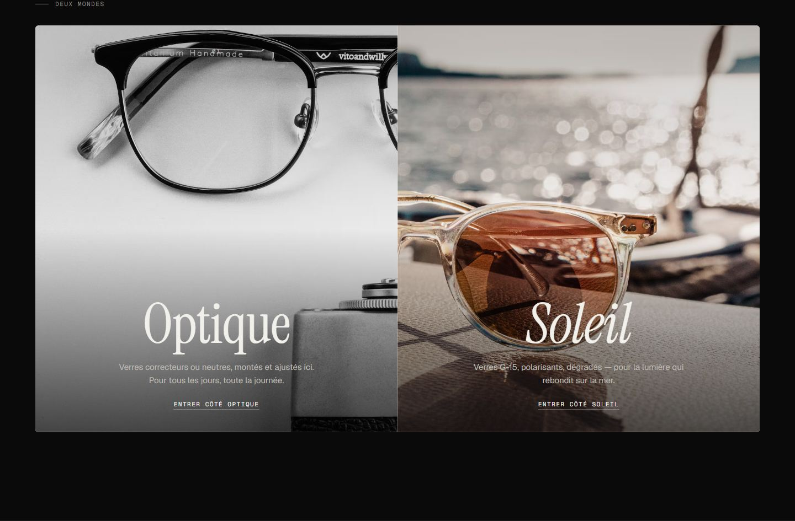 | 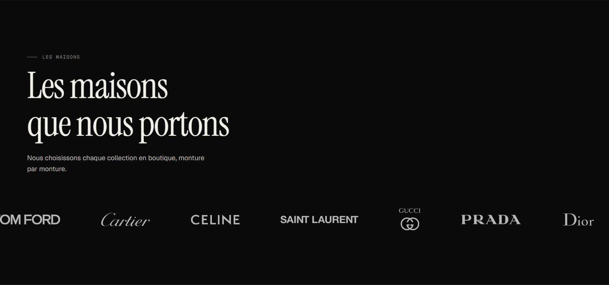 |
| **Deux mondes.** Hover widens a side to 62% (clip-path) and brings its photo up to full colour. | **Les maisons.** Real brand marks in a slow CSS marquee, server-rendered. |
| 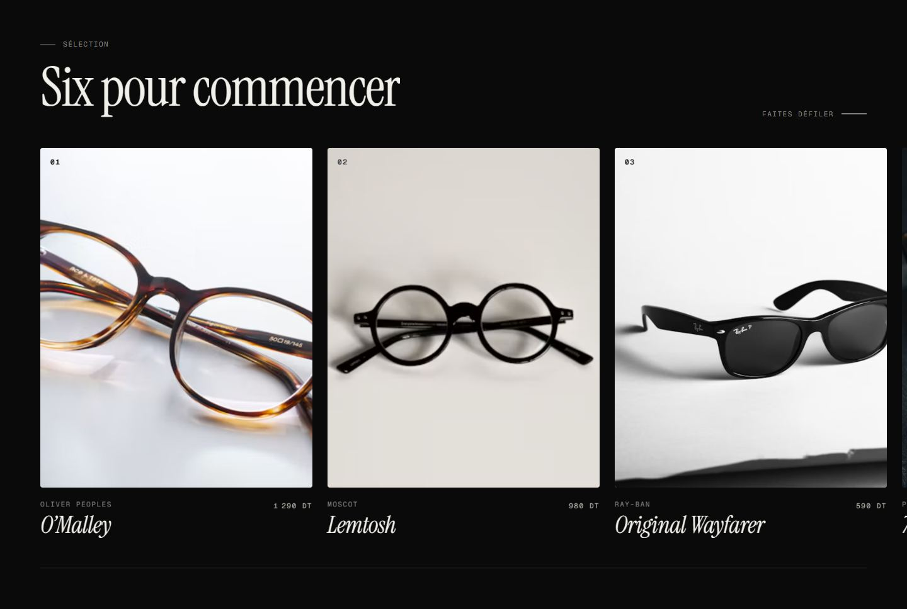 | 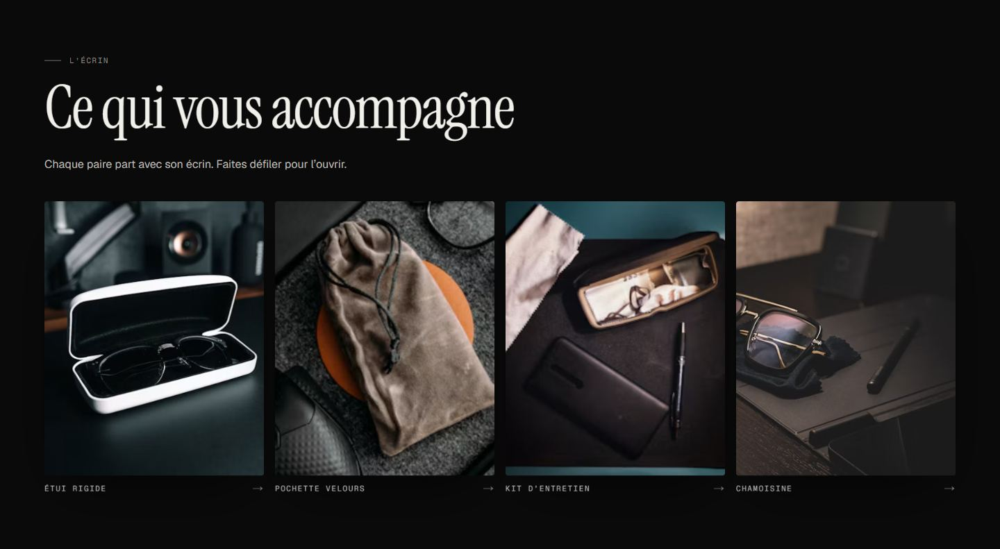 |
| **Sélection.** Pinned horizontal scroll on desktop, native swipe carousel on phones. | **L'écrin.** A scroll-scrubbed unboxing: the gift box lifts and the contents rise into a row. |

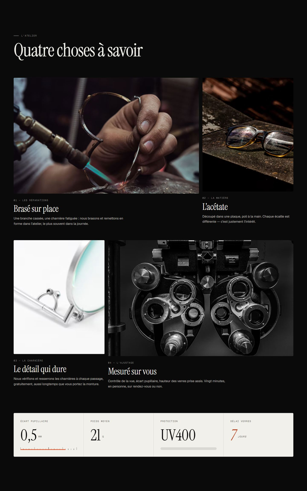

| | |
|---|---|
| 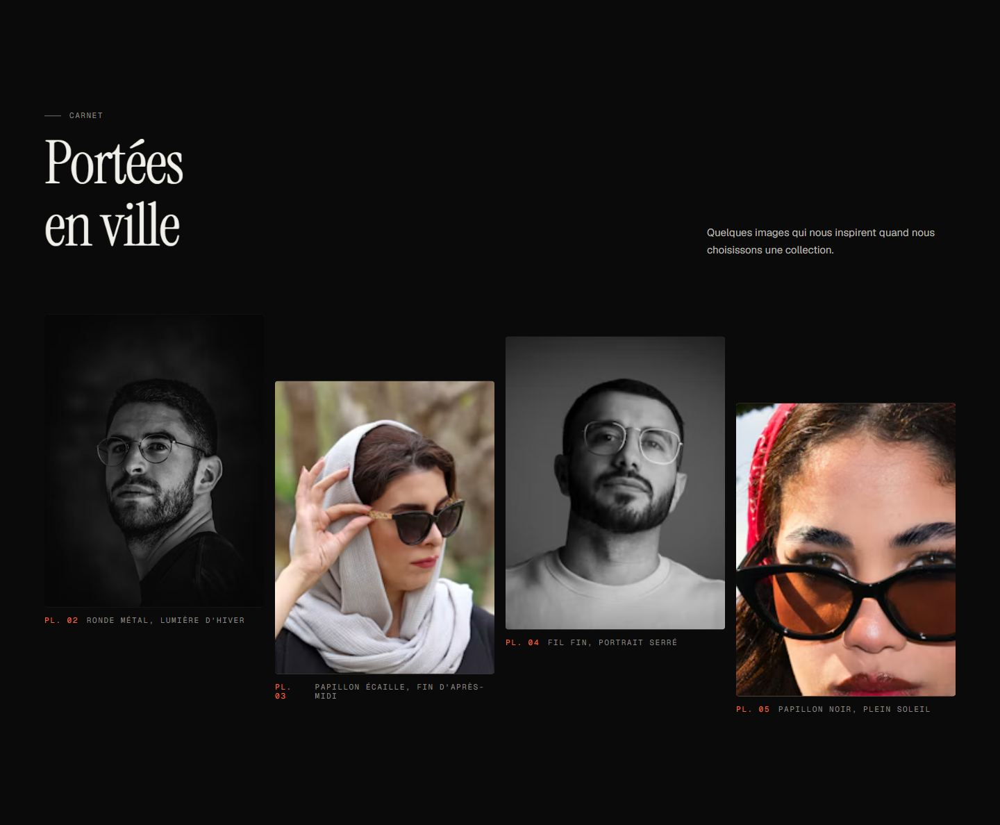 | 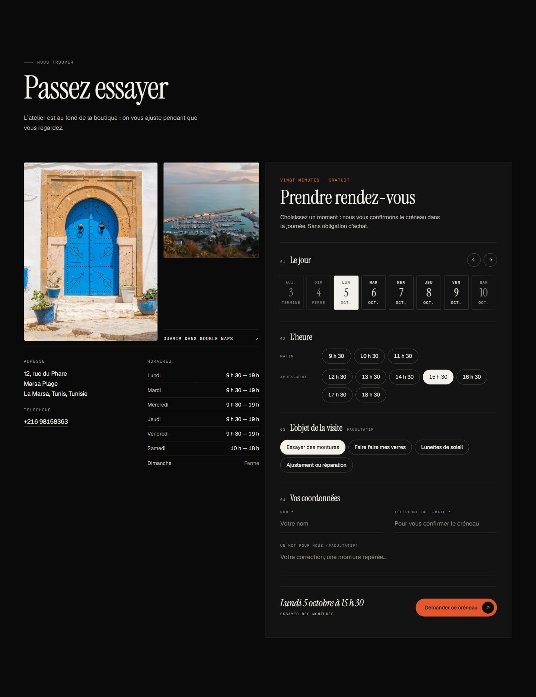 |
| **Carnet.** Editorial portraits, captioned like plates. | **Nous trouver.** Sidi Bou Said photography, hours, a Google Maps link and the booking form: pick a day, a time from the opening hours, and a reason. |
| 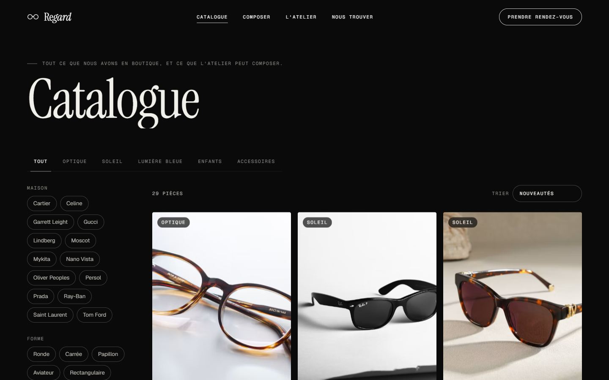 | 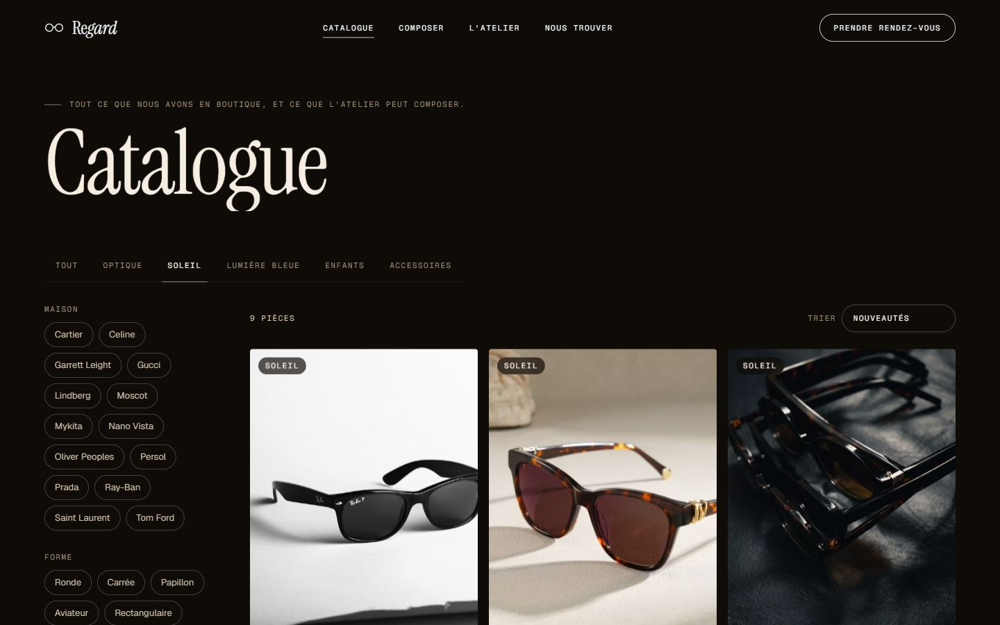 |
| **Catalogue.** Filter by house, shape, colour, material, fit and price. Every filter lives in the URL. | **SUN MODE.** The same page, crossfaded into the warmer theme. |
| 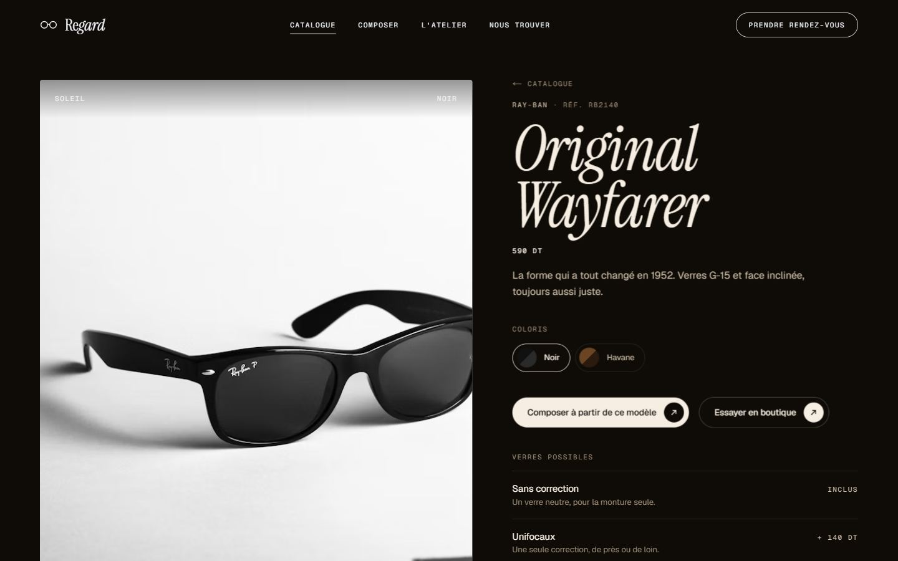 | 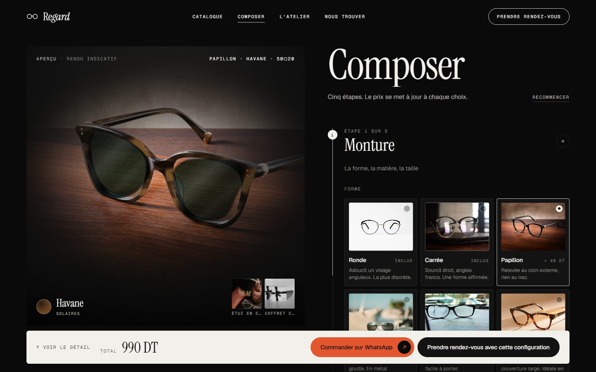 |
| **Fiche produit.** Brand and reference, colourways, possible lenses, a measurement diagram, related frames. | **Composer.** Five steps with a live preview: the frame repainted in the chosen material, the lenses tinted, the case engraved. |

<p align="center">
  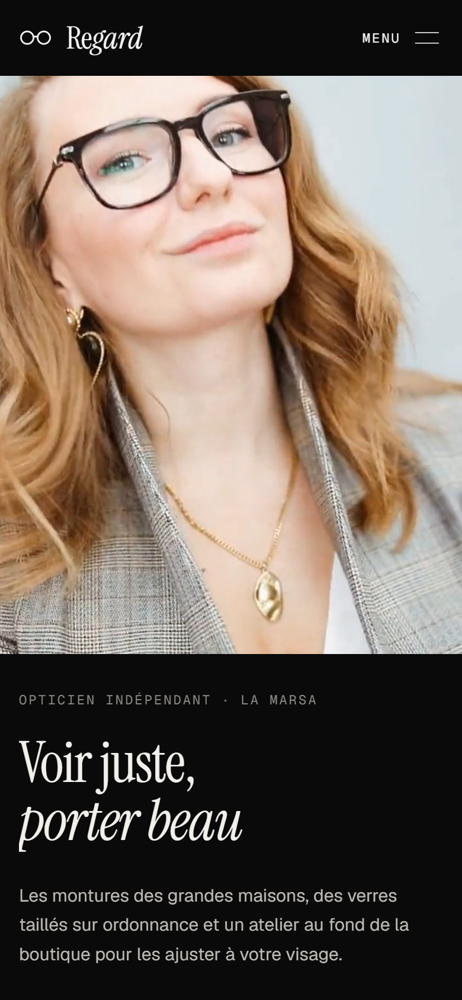
  &nbsp;
  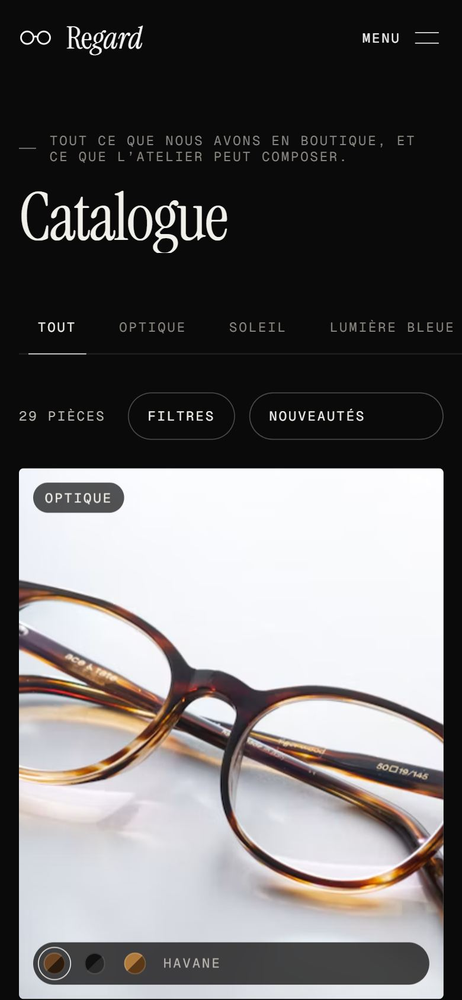
  &nbsp;
  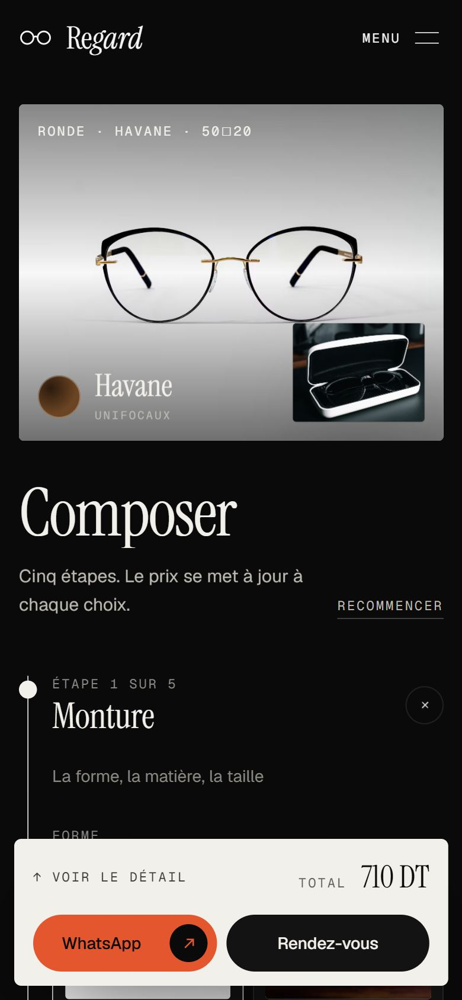
</p>

## Stack

| | |
|---|---|
| Framework | **Next.js 16** (App Router, Turbopack), **React 19**, TypeScript `strict` |
| Styling | **Tailwind CSS v4**, CSS-first `@theme inline` mapped onto CSS-variable tokens |
| Motion | **GSAP + ScrollTrigger** for scroll choreography (lazy-loaded), **Lenis** smooth scroll, **Motion** for layout transitions |
| State | **Zustand** for the configurator |
| Type | Instrument Serif (display), Geist (text), Geist Mono (labels), via `next/font` |
| Images | `next/image` with a custom loader that sizes Unsplash photos on Unsplash's CDN |
| Backend | One route handler. Orders go out as a WhatsApp deep link; bookings are emailed through [Resend](https://resend.com) when configured, and handed to WhatsApp otherwise. |

No UI kit, no component library, no template.

## Getting started

Requires **Node 22+**.

```bash
npm install
cp .env.example .env.local   # optional — only needed for `npm run photos`
npm run dev                  # http://localhost:3000
```

| Script | |
|---|---|
| `npm run dev` | Development server |
| `npm run build` | Production build (type-checks, prerenders 41 routes) |
| `npm run start` | Serve the production build |
| `npm run typecheck` | `tsc --noEmit` |
| `npm run photos` | Pings Unsplash's download endpoint for every photo in use (see [licences](#media-licences-and-credits)) |

### Environment

All optional; copy `.env.example` to `.env.local`.

| Variable | Needed for |
|---|---|
| `RESEND_API_KEY` | Emailing booking requests to the shop |
| `BOOKING_TO_EMAIL` | The inbox that receives them |
| `BOOKING_FROM_EMAIL` | Sender on a domain verified in Resend (defaults to `onboarding@resend.dev`) |
| `UNSPLASH_ACCESS_KEY` | `npm run photos` only. The site never calls the Unsplash API at runtime: photos are pinned in `content/photos.ts` and served from Unsplash's CDN. |

Without the three booking variables the site still works: the form hands each request to a pre-filled WhatsApp message instead of claiming it was sent.

## Project structure

```
app/
  page.tsx                 home — preloader, hero and eleven sections
  catalogue/page.tsx       catalogue (rendered per request so filters are in the HTML)
  catalogue/[slug]/        product pages, statically generated
  composer/                the configurator
  credits/                 photographers and footage
  api/booking/route.ts     booking endpoint — validates, emails via Resend if configured
  opengraph-image.tsx      share image, generated from the brand word
  icon.tsx, apple-icon.tsx favicons from the two-circle mark
  sitemap.ts, robots.ts
components/
  motion/                  Focus, SplitLines, LensCursor, RouteAperture, Magnetic,
                           SmoothScroll, ThemeProvider (SUN MODE), useScrollScene
  media/Photo.tsx          the one way a photograph is shown
  sections/                Hero, Manifesto, TwoWorlds, BrandsWall, Featured,
                           BuilderTeaser, Atelier, TheBox, Lookbook, Voices, Visit,
                           Nav, Footer, Preloader, BookingForm
  catalogue/               Catalogue, Filters, ProductCard, ProductView, SizeDiagram
  builder/                 Builder, Preview, PreviewStage, Steps, Choices, OptionIcon, SummaryBar
  ui/                      Pill, SectionHead, BrandWord, FitWord
  seo/JsonLd.tsx           schema.org blocks (Optician on the home page, Product per product)
content/                   ← everything you edit lives here
  site.ts                  name, tagline, address, hours, phone, WhatsApp, socials, domain
  copy.ts                  every string on the site, in French
  products.ts              29 products: frames by house, plus house accessories
  builder.ts               configurator options and prices
  brands.ts                houses carried and their logos
  plates.ts                where the frame and lenses sit in each shape photo (for the preview)
  photos.ts                every photograph: URL, size, colour, alt text, credit
  types.ts                 the data model
lib/                       builder logic (URL codec, validation, quote), catalogue
                           filtering, structured data, motion constants, image loader, hooks
public/
  video/                   hero clip (1920 and 960 px) and posters
  brands/                  brand logo SVGs
scripts/photos.mjs         Unsplash download tracking
docs/screenshots/          the images in this README
```

## Editing the content

Nothing brand-specific is hard-coded in a component.

| To change… | Edit |
|---|---|
| The shop's name (hero word, nav, footer, metadata, share image) | `content/site.ts` → `brand` |
| Address, map position, hours, phone, WhatsApp number, socials, domain | `content/site.ts` (hours are 24 h `opens`/`closes`; the French display and the search-engine data are both built from them) |
| Any sentence on the site | `content/copy.ts` |
| A product, its price, colourways, measurements | `content/products.ts` |
| Configurator options and prices | `content/builder.ts` |
| The houses on the logo wall | `content/brands.ts` (`logoWall`) |
| A photograph | `content/photos.ts`, then point a product or section at its key |
| The hero clip | replace `public/video/hero-1920.mp4`, its 4:5 phone cut `hero-portrait.mp4` and `hero-poster.jpg` |

### `REVEAL_AT`

```ts
// lib/motion.ts
export const REVEAL_AT = 5
```

This is the second of the hero clip at which the copy starts arriving. In the current film the camera passes through the lens at about 4 s and settles on the second shot by 5.3 s; she puts the glasses on and the film ends at 7.5 s on her smile. **To change it, edit that one number.** If you swap the clip, set it to the moment the footage settles. The hero reveals anyway on `ended`, on a video `error`, on a rejected `play()`, and after a 9 s timeout.

The stat-card thumbnails are cut from the clip's last frame: the glasses and her earring. Their crop rectangles are `CROPS` at the top of `components/sections/Hero.tsx`, given for the landscape clip and converted for the portrait cut through `PORTRAIT`.

## How it works

- **Hero.** On `loadeddata`, and again during playback until a sample lands, the clip's top-left pixel is read into a 1×1 canvas. That colour becomes the stage background and, 12% darker, the ghost colour of the word. Under reduced motion the clip jumps to its last frame and everything appears at once.
- **Scroll scenes.** `useScrollScene` loads GSAP only when a scene nears the viewport, or once the page is idle. Each scene runs in a `gsap.context` scoped to its section and is reverted on unmount, so ScrollTriggers never leak between routes. Pins are measured top to bottom.
- **Catalogue.** All state lives in the URL (`?category=sun&brand=ray-ban,persol&sort=price-asc`), written with the History API, so every view is a shareable link and Back walks through category changes. Cards animate with layout transitions and leave by blurring out.
- **Configurator.** The whole configuration is a readable query string (`/composer?shape=cat-eye&cw=noir&lens=sun&coat=polarised&case=leather&gift=1&eng=SM`). It is restored on load and mirrored to `localStorage`. Invalid combinations are declared as data in `content/builder.ts`: polarised only with sun lenses, aviators in metal only, engraving only with the gift box. They render disabled with the reason shown, and are normalised away if they arrive in a link.
- **Configurator preview.** The main picture is a real photograph of the chosen shape, worked on in the browser. An SVG filter repaints the frame in the chosen material: tortoiseshell is generated noise mapped through the acetate's own colours, while black, crystal, titanium and gold are flat tones. The photo's own shading is kept, so curves and highlights survive. The repaint is limited to the frame by outlines traced for each photo (`content/plates.ts`). Tinted layers go over the lenses: smoke for sun lenses, G-15 green when polarised, grey for photochromic, a warm cast for the blue filter, and a faint green sheen for anti-reflective. A new shape fades in over the last with a focus pull, a new material fades over the old frame, and a size change eases the shot closer. It is a representative rendering, labelled *Rendu indicatif*, not a photo of the exact frame.
- **Orders.** "Commander sur WhatsApp" opens `wa.me/<number>` with the itemised configuration, the total and a link back to it. "Prendre rendez-vous avec cette configuration" opens the booking form with the build attached.
- **Bookings.** The form works like an appointment book. A strip of the next fourteen days shows closed days as closed and a day with nothing left as full. The chosen day's slots come from the opening hours in `site.ts`, hourly from opening to half an hour before closing, with today's slots starting an hour from now. Then the reason for the visit and the visitor's details; the chosen slot is spelled out above the button (*Lundi 5 octobre à 10 h 30*). The form posts to `/api/booking`, which validates the request and emails it to the shop when Resend is configured (replies go straight to the visitor if they left an email). If email isn't configured or the request fails, the form says so and offers the same request as a pre-filled WhatsApp message, so a booking is never silently lost. A hidden honeypot field drops spam bots.
- **Search engines.** The home page carries an `Optician` schema (address, coordinates, opening hours, phone) and each product page a `Product` schema (brand, reference, photo, price in TND, in-store availability). Product pages share their own photo as the Open Graph image.
- **Headers.** Every response sends `X-Content-Type-Options`, `Referrer-Policy`, `X-Frame-Options`, `Permissions-Policy` and HSTS. The video and logos are cached for a week. A Content Security Policy is left out because it would need nonces for Next's inline scripts.
- **Lens cursor.** On desktop, a 90 px ring trails the pointer. Over product photos it becomes a 1.6× loupe; over links it shrinks to a dot with a label. It is off on touch and under reduced motion.

## Before launch

Every value to replace is marked `// PLACEHOLDER` in `/content`.

- [ ] **Name and identity.** `site.ts`: `brand`, `tagline`, `summary`, `url`
- [ ] **Contact.** `site.ts`: `address`, `mapsUrl`, `coordinates`, `hours`, `phone`, **`whatsapp`** (digits only, country code first), `socials`
- [ ] **Brands.** `brands.ts`: confirm the shop is an authorised stockist of every house shown; remove any it doesn't carry
- [ ] **Products.** `products.ts`: prices, colourway lists, descriptions, measurements
- [ ] **Product photos.** `photos.ts`: product images are Unsplash stand-ins. Replace them with the distributors' official shots.
- [ ] **Configurator prices.** `builder.ts`: base price and every delta
- [ ] **Configurator photos.** `builder.ts` → `shapeOptions[].photo`: one shot per shape. The best results come from studio shots on a plain background. After swapping a photo, retrace its frame and lens outlines in `plates.ts`.
- [ ] **Testimonials.** `copy.ts` → `voices`: all three are invented
- [ ] **Stats.** `copy.ts` → `hero.stats` and `atelier.stats`
- [ ] **Booking emails.** Create a Resend account, verify the shop's domain, and set `RESEND_API_KEY`, `BOOKING_TO_EMAIL` and `BOOKING_FROM_EMAIL`. Until then bookings arrive through WhatsApp.
- [ ] **Map position.** `site.ts` → `GEO` (it drives the coordinates label and the search-engine data)
- [ ] **Legal page.** A *mentions légales* / privacy notice. The booking form collects names and phone numbers, and the wording has to come from the client.
- [ ] **Unsplash.** If you change any photo, run `npm run photos` again (all 50 current photos are registered)
- [ ] **Domain.** Set `site.url` so canonical URLs, the sitemap and share links are right

## Media, licences and credits

- **Photography.** [Unsplash](https://unsplash.com/license), hot-linked from Unsplash's CDN as their API guidelines require. Every photographer is credited on `/credits`. All 50 photos have been registered with Unsplash's download endpoint (`npm run photos`), which the guidelines also ask for.
- **Hero footage.** Two Pexels clips, [5995502](https://www.pexels.com/video/5995502/) (the frame on the chart) and [6006380](https://www.pexels.com/video/6006380/) (the fitting), under the Pexels licence (free for commercial use, no attribution required; credited on `/credits` anyway). The film is rendered frame by frame (camera zoom, roll, blur, the lens-shaped reveal and the bloom) and encoded at 1920 px (2.2 MB) plus a 720×900 portrait cut for phones (0.8 MB), muted, faststart.
- **Brand logos.** Public-domain text marks from Wikimedia Commons, in `public/brands/`. **They remain registered trademarks.** They are shown to indicate collections carried in store, which presumes the client is an authorised stockist (see the launch checklist). The Moscot file had its yellow sign background removed so it renders as a mark.
- **Testimonials.** The quotes are text only, on purpose: stock photos of real people next to invented reviews would present strangers as customers.

## Quality checks

| Check | Result |
|---|---|
| Production build | ✅ 41 routes, TypeScript strict |
| axe-core (WCAG 2.1 A/AA + best practice) | ✅ 0 violations on home, catalogue, catalogue in SUN MODE, a frame page, an accessory page, the configurator and credits, at 1440 px and 390 px |
| Horizontal overflow at 390 px | ✅ none on any page |
| Keyboard | ✅ skip link, visible focus rings, mobile menu traps focus and closes on Escape, filter sheet traps focus |
| Reduced motion | ✅ no Lenis, no pinning, no blur; every section renders complete at rest |
| Configurator logic | ✅ scripted test: polarised gating, metal-only aviator, engraving tied to the gift box, totals, URL round-trip, `localStorage` restore, WhatsApp message |
| Booking | ✅ scripted test on a phone: empty submit flags day, time, name and contact and focuses the day strip; a Monday 10 h 30 booking posts slot, reason and the attached configuration; `delivered: false` without email → WhatsApp hand-off with the same details |
| Structured data and headers | ✅ verified on the built site |
| Layout shift (CLS) | ✅ 0.000 on home, catalogue, a product page and the configurator (emulated phone, 4× CPU slowdown) |
| Lighthouse (mobile) | ⚠️ **not measured on this build.** An earlier build scored Accessibility 97–100, Best Practices 100, SEO 100 and CLS 0, but Performance 64–84, below the 90 target. Since then: the catalogue no longer runs a blur on every photo at load, card labels use solid fills instead of backdrop blur, and smooth scrolling no longer runs its loop on touch devices. The home page stays constrained by design, because the preloader plus a 3.6 s reveal delays its largest text. Measure on Vercel (PageSpeed Insights) rather than locally: CPU-throttled runs on the development machine varied by more than 5× between identical loads. |

Animation is limited to `transform`, `opacity`, `filter` and `clip-path`. Fonts, video and images reserve their space, so the page doesn't shift.

## Deploying

The project is ready for **Vercel**: import the repository and deploy, with no configuration needed. Add `UNSPLASH_ACCESS_KEY` to the environment only if you plan to run `npm run photos` there.

---

Designed and built by [Hassan Jebri](https://hassan-jebri-portfolio.vercel.app/).
